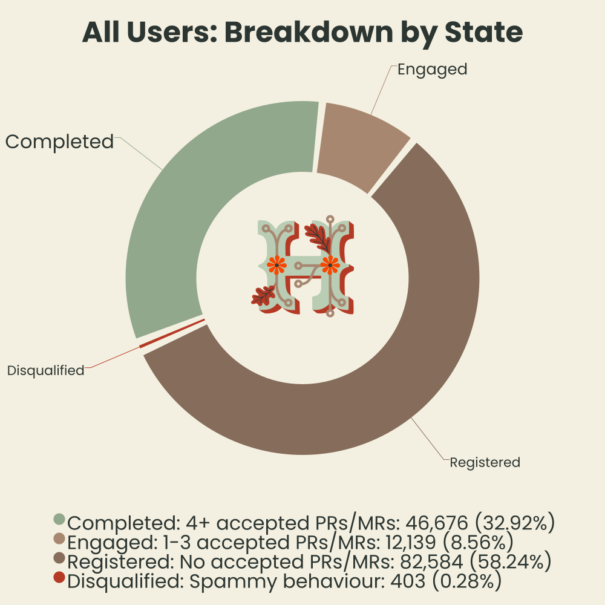
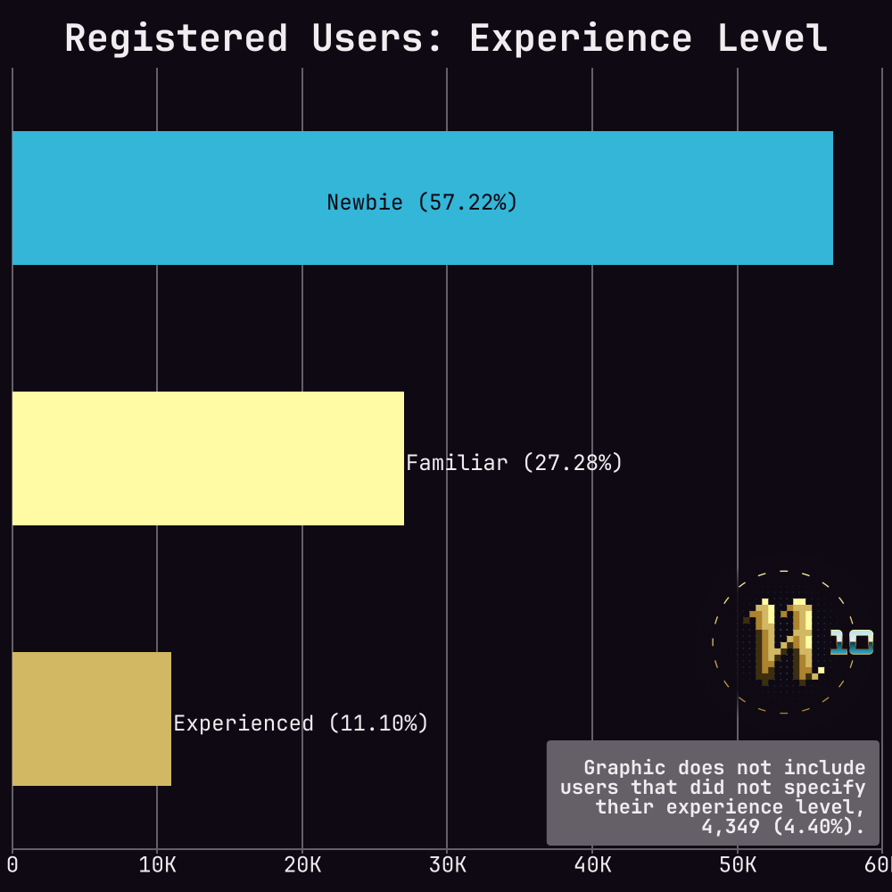
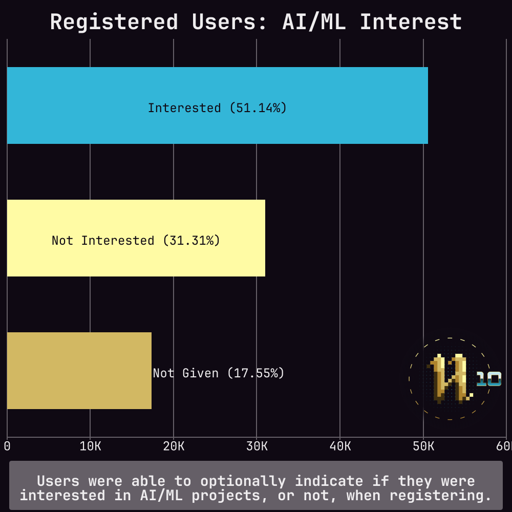
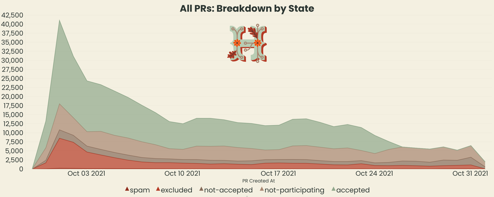
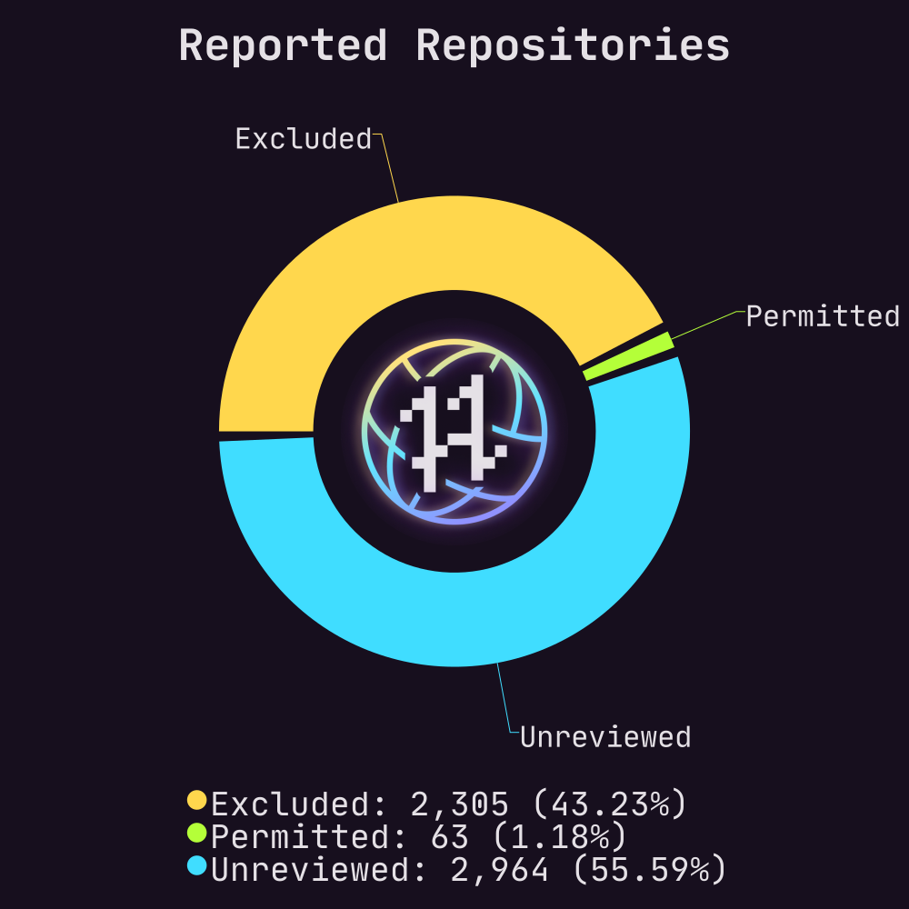

# Hacktoberfest 2023 Stats

Hi there, 👋

I'm [Matt Cowley](https://mattcowley.co.uk/), Senior Software Engineer II at [DigitalOcean](https://digitalocean.com/).

I work on a bunch of things at DigitalOcean, with a great mix of engineering, developer relations and community management. And, part of what I get to work on is helping out with Hacktoberfest, including being the lead engineer for the backend that powers the event.

Welcome to my deeper dive on the data and stats for Hacktoberfest 2023, expanding on what we already shared in our [recap blog post](https://www.digitalocean.com/blog/10th-anniversary-hacktoberfest-recap).

## At a glance

What did we accomplish together in October 2023? These are the highlights from Hacktoberfest #10:

- Registered users: **98,855**
- Engaged users (1-3 accepted PR/MRs): **8,325**
- Completed users (4+ accepted PR/MRs): **15,523**
- Accepted PR/MRs: **118,469**
- Active repositories (1+ accepted PR/MRs): **31,711**
- Countries represented by registered users: **184**
- Countries represented by completed users: **121**

> Take a read of our overall recap blog post for Hacktoberfest 2023 here:
> [www.digitalocean.com/blog/10th-anniversary-hacktoberfest-recap](https://www.digitalocean.com/blog/10th-anniversary-hacktoberfest-recap)

## Application states

Before jumping in and looking at the data in detail, we should first cover some important information about how we categorise users and pull/merge requests in the Hacktoberfest application and in the data used here.

For users, there are four key states that you'll see:

- **Completed**: A user that submitted four or more accepted PR/MRs during Hacktoberfest.
- **Engaged**: A user that submitted between one and three accepted PR/MRs during Hacktoberfest.
- **Registered**: A user that completed the registration flow for Hacktoberfest, but did not submit
  any PR/MRs that were accepted.
- **Disqualified**: A user that was disqualified for submitting 2 or more spammy PR/MRs,
  irrespective of how many accepted PR/MRs they may have also had.

For pull/merge requests, there are six states used to process them that you'll see:

- **Accepted**: A PR/MR that was accepted by a project maintainer, either by being merged or
  approved in a participating repository, or by being given the `hacktoberfest-accepted` label.
- **Not accepted**: Any PR/MR that was submitted to a participating repository (having the
  `hacktoberfest` topic), but that was not actively accepted by a maintainer.
- **Not participating**: Any PR/MR that was submitted by a participant to a repository that was not
  participating in Hacktoberfest (i.e. having the `hacktoberfest` topic, or adding the
  `hacktoberfest-accepted` label to specific PRs).
- **Invalid**: Any PR/MR that was given a label containing the word `invalid` by a maintainer. Any
  PR/MR with a matching label was not counted towards a participant's total.
- **Spam**: Any PR/MR that was given a label by a maintainer containing the 'spam', or PR/MRs that 
  our abuse logic detected as spam. These are not counted toward winning, and also count toward a
  user being disqualified.
- **Excluded**: Any PR/MR that was submitted to a repository that has been excluded from
  Hacktoberfest for not following our values. These do not count toward winning, nor do they count
  toward a user being disqualified.

## Diving in: Users

This year, Hacktoberfest had **98,855** folks who went through our registration flow for the event. Spam has been a huge focus for us throughout the event, as with previous years, and so during this flow folks were reminded about our rules and values for the event with clear and simple language, as well as agreeing to a rule that folks with two or more PR/MRs identified as spam by maintainers would be disqualified. More on this later.

During the registration flow, folks can also choose to tell us which country they are from--this helps us better understand, and cater to, the global audience for the event--and **99.84%** of them did so.

  
  

The top country, by far, was once again India with **54,883 (55.52%)** registrants self-identifying as being from there, showing how much of a reach open-source, and tech in general, has there.

We can see the true global reach of Hacktoberfest and open-source by looking at more of the top countries based on registrations:

1. India: 54,883 (55.52%)
2. United States: 4,815 (4.87%)
3. Brazil: 2,640 (2.67%)
4. Indonesia: 1,742 (1.76%)
5. Pakistan: 1,692 (1.71%)
6. Nigeria: 1,664 (1.68%)
7. Germany: 1,560 (1.58%)
8. Sri Lanka: 1,418 (1.43%)
9. United Kingdom: 1,078 (1.09%)
10. Canada: 1,067 (1.08%)

In total, **184 countries** were represented by folks that registered for the 2023 event.

We can also look at just the users that completed Hacktoberfest, and see how the countries are distributed for those users:

1. India: 7,905 (50.92%)
2. United States: 823 (5.30%)
3. Germany: 418 (2.69%)
4. Brazil: 363 (2.34%)
5. Sri Lanka: 338 (2.18%)
6. Indonesia: 222 (1.43%)
7. United Kingdom: 218 (1.40%)
8. Pakistan: 208 (1.34%)
9. France: 188 (1.21%)
10. Canada: 173 (1.11%)

Of course, there's more to Hacktoberfest than just registering for the event, folks actually submit PR/MRs to open-source projects! This year, we had **23,848 users (24.12% of total registrations)** that submitted one or more PR/MRs that were accepted by maintainers. Of those, **15,523 (65.09%) (15.70% of total registrations)** went on to submit at least four accepted PR/MRs to successfully complete Hacktoberfest.

Impressively, we saw that **8,424 users (54.27% of total completed)** submitted more than 4 accepted PR/MRs, going above and beyond to contribute to open-source outside the goal set for completing Hacktoberfest.

This year, Hacktoberfest removed the free t-shirt as a reward for completing Hacktoberfest, instead replacing it with a digital reward kit unlocked once you had for accepted PR/MRs, and a digital badge from Holopin that levelled up with each PR/MR accepted on your journey from registration to completion. While we still saw many folks register and engage with Hacktoberfest, the numbers are much lower than previous years, likely due to this change in reward, and while disappointing this was expected.

Sadly, 82 users were disqualified this year (0.08% of total registrations), with an additional 219 (0.22% of total registrations) warned. Disqualification of users happen automatically if two or more of their PR/MRs are actively identified as spam by project maintainers, with users being sent a warning email (and shown a notice on their profile) when they have one PR/MR that is identified as spam. We were very happy to see how low this number was though, indicating to us that our efforts to educate and remind contributors of the quality standards expected of them during Hacktoberfest are working. _(Of course, we can only report on what we see in our data here, and do acknowledge that folks may have received spam that wasn't flagged so won't be represented in our reporting)._

<!-- Clear for generated/users_by_state_doughnut.png -->

Hacktoberfest supported multiple providers this year, GitHub & GitLab. Registrants could choose to link just one provider to their account, or multiple if they desired, with contributions from each provider combined into a single record for the user.

Based on this we can take a look at the most popular providers for open-source based on some Hacktoberfest-specific metrics. First, we can see that based on registrations, **the most popular provider was GitHub with 98,515 registrants (99.66%).**

1. GitHub: 98,515
  (99.66% of registered users)
2. GitLab: 1,306
  (1.32% of registered users)

_Users were able to link one or more providers to their account, so the counts here may sum to more than the total number of users registered._

We can also look at a breakdown of users that were engaged (1-3 accepted PR/MRs) and users that completed Hacktoberfest (4+ PR/MRs) by provider.

Engaged users by provider:

- GitHub: 8,319
  (99.93% of engaged users)
- GitLab: 135
  (1.62% of engaged users)

Completed users by provider:

- GitHub: 15,500
  (99.85% of completed users)
- GitLab: 343
  (2.21% of completed users)

When registering for Hacktoberfest, we also asked users for some optional self-identification around their experience with contributing to open-source, and how they intended to contribute. First, we can take a look at the experience level users self-identified as having when registering:

- Newbie: 56,566
  (57.22% of registered users)
- Familiar: 26,969
  (27.28% of registered users)
- Experienced: 10,971
  (11.10% of registered users)

_4,349 users did not self-identify their experience level._

We can compare this to the breakdown of users that completed Hacktoberfest by experience level:

- Newbie: 6,337
  (40.82% of completed users)
- Familiar: 4,963
  (31.97% of completed users)
- Experienced: 3,409
  (21.96% of completed users)

_814 users who completed Hacktoberfest did not self-identify their experience when registering._

<!-- Clear for generated/users_registrations_experience_level_bar.png -->

Not everyone is comfortable writing code, and so Hacktoberfest focused on encouraging more contributors to get involved with open-source this year through non-code contributors. We can look at what contribution types users indicated they intended to make during Hacktoberfest when registering (they could pick multiple, or none):

- Code: 89,786
  (90.83% of registered users)
- Non-code: 46,257
  (46.79% of registered users)

_Of course, this is only what users indicated they intended to do, and doesn't necessarily reflect their actual contributions they ended up making to open-source (determining what is and what isn't a "non-code" PR/MR would be a difficult task)._

This year, we also asked users during registration whether they were students or not, to give us a better sense of the audience that is participating in Hacktoberfest. We can see that **60,826 users (61.53% of registered users)** indicated that they were students when registering.

Folks were also asked if they'd be interested in contributing to AI/ML projects specifically during Hacktoberfest, as this area of open-source is growing rapidly and we wanted to see if there was interest in it.

We can see that **50,550 users (51.14% of registered users)** indicated they were actively interested in AI/ML projects, while **30,953 users (31.31% of registered users)** indicated they were not interested in AI/ML projects (this was an optional question, with 17,352 users not providing a preference).

While we obviously can't know for sure the preference of those that did not interact with this question, there was a much larger portion of folks registering that did not engage with this question than other questions (17.55%, compared to just 4.40% that did not indicate their experience level), which is likely an indicator that many felt a negative sentiment towards AI/ML projects.

<!-- Clear for generated/users_registrations_ai_ml_interest_bar.png -->

As with previous years of Hacktoberfest, users had to submit PR/MRs to participating projects during October that then had to be accepted by maintainers during October. If a user submitted four or more PR/MRs, then they completed Hacktoberfest. However, not everyone hits the 4 PR/MR target, with some falling short, and many going beyond the target to contribute further.

We can see how many accepted PR/MRs each user had and bucket them:

- 1
  PR/MR: 5,057
  (32.58%)
- 2
  PRs/MRs: 2,114
  (13.62%)
- 3
  PRs/MRs: 1,163
  (7.49%)
- 4
  PRs/MRs: 7,120
  (45.87%)
- 5
  PRs/MRs: 3,079
  (19.84%)
- 6
  PRs/MRs: 1,629
  (10.49%)
- 7
  PRs/MRs: 916
  (5.90%)
- 8
  PRs/MRs: 588
  (3.79%)
- 9
  PRs/MRs: 443
  (2.85%)
- 10+
  PRs/MRs: 1,769
  (11.40%)

Looking at this, we can see that quite a few users only managed to get 1 accepted PR/MR, but after that it quickly trailed off for 2 and 3 PR/MRs. It seems like the target of 4 PR/MRs encouraged many users to push through to getting all 4 PR/MRs created/accepted if they got that first one completed.

## Diving in: Pull/Merge Requests

Now on to what you've been waiting for, and the core of Hacktoberfest itself, the pull/merge requests. This year Hacktoberfest tracked **267,408** PR/MRs that were within the bounds of the Hacktoberfest event, and **118,469 (44.30%)** of those went on to be accepted!

Unfortunately, not every pull/merge request can be accepted though, for one reason or another, and this year we saw that there were **25,112 (9.39%)** PR/MRs that were submitted to participating repositories but that were not accepted by maintainers, as well as **82,319 (30.78%)** PR/MRs submitted by Hacktoberfest participants to repositories that were not participating in Hacktoberfest. As a reminder to folks, repositories opt-in to participating in Hacktoberfest by adding the `hacktoberfest` topic to their repository (or individual PR/MRs can be opted-in with the `hacktoberfest-accepted` label)!

Spam is also a big issue that we focus on reducing during Hacktoberfest, and we tracked the number of PR/MRs that were identified by maintainers as spam, as well as those that were caught by automation we'd written to stop spammy users. We'll talk more about all-things-spam later on.

<!-- Clear for generated/prs_by_state_doughnut.png -->

This year, Hacktoberfest supported multiple providers that contributors could use to submit contributions to open-source projects. Let's take a look at the breakdown of PR/MRs per provider:

1. GitHub: 266,560
  (99.68% of total PR/MRs)
2. GitLab: 848
  (0.32% of total PR/MRs)

PRs and MRs that are accepted by maintainers for Hacktoberfest aren't necessarily merged -- Hacktoberfest supports multiple different ways for a maintainer to indicate that a PR/MR is legitimate and should be counted. PR/MRs can be merged, or they can be given the `hacktoberfest-accepted` label, or maintainers can leave an overall approving review.

Of the accepted PR/MRs, **116,233 (98.11%)** were merged into the repository, and **32,676 (27.58%)** were approved by a maintainer. Note that there may be overlap here, as a PR/MR may have been approved and then merged. Unfortunately, we don't have direct aggregated data for the `hacktoberfest-accepted` label.

With this many accepted PRs, we can also take a look at some interesting averages determined from the accepted PR/MRs. The average accepted PR/MR...

- ...contained **2.91 commits**
- ...added/edited/removed **11.2 files**
- ...made a total of **1,117.42 additions** _(lines)_
- ...included **400.76 deletions** _(lines)_

_Note that lines containing edits will be counted as both an addition and a deletion._

We can also take a look at all the different languages that we observed during Hacktoberfest. These are based on the primary language reported for the repository, and the number of accepted Hacktoberfest PRs that were submitted to that repository. Unfortunately, GitLab does not expose language information via their API, so this only considers GitHub PRs.

1. JavaScript: 16,697
  (14.09% of all accepted PRs)
2. Python: 14,851
  (12.54% of all accepted PRs)
3. TypeScript: 12,879
  (10.87% of all accepted PRs)
4. HTML: 11,175
  (9.43% of all accepted PRs)
5. C++: 10,679
  (9.01% of all accepted PRs)
6. Java: 7,759
  (6.55% of all accepted PRs)
7. Jupyter Notebook: 5,028
  (4.24% of all accepted PRs)
8. Ruby: 4,389
  (3.70% of all accepted PRs)
9. CSS: 3,362
  (2.84% of all accepted PRs)
10. Go: 3,338
  (2.82% of all accepted PRs)

Hacktoberfest happens throughout the month of October, with participants allowed to submit pull/merge requests at any point from October 1 - 31 in any timezone. However, there tends to be large spikes in submitted PR/MRs towards the start and end of the month as folks are reminded to get them in to count! Let's take a look at the most popular days during Hacktoberfest by accepted PR/MR creation this year:

1. 2023-10-02: 5,672
  (4.79% of all accepted PRs)
2. 2023-10-01: 5,418
  (4.57% of all accepted PRs)
3. 2023-10-03: 4,615
  (3.90% of all accepted PRs)
4. 2023-10-24: 4,589
  (3.87% of all accepted PRs)
5. 2023-10-04: 4,320
  (3.65% of all accepted PRs)
6. 2023-10-11: 4,241
  (3.58% of all accepted PRs)
7. 2023-10-07: 4,077
  (3.44% of all accepted PRs)
8. 2023-10-09: 4,064
  (3.43% of all accepted PRs)
9. 2023-10-14: 4,060
  (3.43% of all accepted PRs)
10. 2023-10-05: 3,989
  (3.37% of all accepted PRs)
11. 2023-10-15: 3,946
  (3.33% of all accepted PRs)
12. 2023-10-10: 3,943
  (3.33% of all accepted PRs)
13. 2023-10-08: 3,939
  (3.32% of all accepted PRs)
14. 2023-10-31: 3,907
  (3.30% of all accepted PRs)
15. 2023-10-16: 3,851
  (3.25% of all accepted PRs)

<!-- Clear for generated/prs_by_day_bar.png -->

## Diving in: Spam

After the issues Hacktoberfest faced at the start of the 2020 event, spam was top of mind for our whole team this year as we planned and launched Hacktoberfest 2023. We kept the rules the same as we'd landed on last year, with Hacktoberfest being an opt-in event for repositories, and  our revised standards on quality contributions to make it easier for participants to understand what is expected of them when contributing to open source as part of Hacktoberfest.

**Our efforts to reduce spam can be seen in our data, with only 332 (0.12%) pull/merge requests being flagged as spam by maintainers (or identified as spam by our automated logic).** _(Of course, we can only report on what we see in our data here, and do acknowledge that folks may have received spam that wasn't flagged so won't be represented in our reporting)._

We also took a stronger stance on excluding repositories reported by the community that did not align with our values, mostly repositories encouraging low effort contributions to allow folks to quickly win Hacktoberfest. Pull/merge requests to a repository that had been excluded from Hacktoberfest, based on community reports, would not be counted for winning Hacktoberfest (but also would not count against individual users in terms of disqualification).

**Excluded repositories accounted for a much larger swathe of pull/merge requests during Hacktoberfest, with 39,859 (14.91%) being discounted due to being submitted to an excluded repository.**

If we plot all pull/merge requests during Hacktoberfest by day, broken down by state, the impact that excluded repositories had can be seen clearly, and also shows that there are significant spikes at the start and end of Hacktoberfest as folks trying to cheat the system tend to do so as Hacktoberfest launches and its on their mind, or when they get our reminder email that Hacktoberfest is ending soon:

For transparency, we can also take a look at the excluded repositories we processed for Hacktoberfest 2023. A large part of this list was prior excluded repositories from previous Hacktoberfest years which were persisted across to this year. However, a form was available on the site for members of our community to report repositories that they felt did not follow our values, with automation in place to process these reports and exclude repositories that were repeatedly reported, as well as reports being reviewed by our team.

In total, Hacktoberfest 2023 had 8,329 repositories that were actively excluded,
70.78% of the total repositories reported. Only 80 repositories were permitted after having been reported and subsequently reviewed by our team. Unfortunately, 3,359 (28.54%) of the repositories that were reported by the community were never reviewed by our team, and did not meet a threshold that triggered any automation for exclusion.

<!-- Clear for generated/repos_reported_doughnut.png -->

## Wrapping up

Well, that's all the stats I've generated from the Hacktoberfest 2023 raw data -- you can find the raw output of the stats generation script in the [`generated/stats.txt`](generated/stats.txt) file, as well as all the graphics which are housed in [`generated`](generated) directory.

If there is anything more you'd like to see/know, please feel free to reach out and ask, I'll be more than happy to generate it if possible.

All the scripts used to generate these stats & graphics are contained in this repository, in the [`src`](src) directory. I have some more information about this in the [CONTRIBUTING.md](CONTRIBUTING.md) file, including a schema for the input data, however, the Hacktoberfest 2023 raw data, much like previous years' data, isn't public.

Author: [Matt Cowley](https://mattcowley.co.uk/) - If you notice any errors within this document please let me know, and I will endeavour to correct them. 💙
