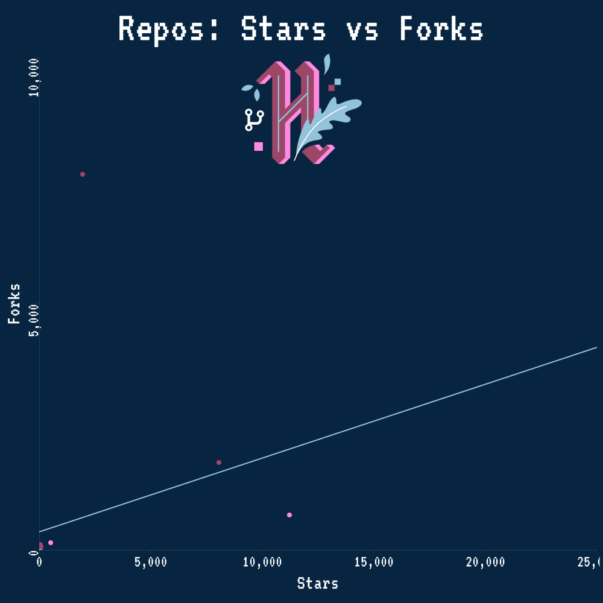

# Hacktoberfest 2020 Stats

Hi there, 👋

I'm [Matt Cowley](https://mattcowley.co.uk/), Community Platform Manager at [DigitalOcean](https://digitalocean.com/).\
I work on some awesome things at DigitalOcean, such as our [Community website](https://digitalocean.com/community) and
 Hacktoberfest, where I help out with social and support engagement as well as the engineering behind the app itself.

Welcome to my stats breakdown from the [Hacktoberfest 2020](https://hacktoberfest.digitalocean.com/) raw GitHub and
 application data.

## At a glance

What did we accomplish together in October 2020? These are the highlights from Hacktoberfest #7:

 - Users who registered for Hacktoberfest 2020\*: **169,886 users**
 - Users who completed and won Hacktoberfest\*: **66,739 users**
 - Eligible pull requests from all participants: **387,052 PRs**
 - Participating repositories: **116,361 repos**
 - Represented countries in participants: **204 countries**
 - Day with the most PRs: 77,993 (20.15%) on October 1
 - Most used license\*\*: MIT in 37,626 repositories (21.37%)
 - Top language: Python with 60,285 eligible PRs (15.58%)

\*_Exact number from the Hacktoberfest database as of 2020-11-26. May differ from other reported numbers._
\*\*_Over 50% of repositories (103,184 [58.61%]) in Hacktoberfest had no license that GitHub could detect._

> Take a read of our overall recap blog post for Hacktoberfest 2020 here:
> https://www.digitalocean.com/blog/hacktoberfest-recap2020/

    
     
    <i>Pull requests each day for the top 10 languages during Hacktoberfest 2020</i>

Before we go any further, we should note that this stats report excludes any users that no longer existed on GitHub
 after Hacktoberfest, as well as excluding any PRs that were no longer publicly available.

## Diving in: Pull Requests

Taking a closer look at the pull requests of Hacktoberfest 2020, we can pull out some more interesting insights.

First of all, we need to take a look at the breakdown of pull requests that Hacktoberfest tracked this year, and how
 many were considered eligible for the competition. In case you missed it, Hacktoberfest became opt-in this year after
 the first few days, requiring a PR be submitted in a repository with the `hacktoberfest` topic and the PR then being
 merged or approved by a maintainer to count, or the PR could be given the `hacktoberfest-accepted` label in any repo to
 count. PRs submitted before the rules change did not need to be accepted, the same as last year.

In total, Hacktoberfest tracked **632,223** pull requests, with **387,052 (61.22%)** of those being eligible and
 counting toward a user winning Hacktoberfest! We can breakdown exactly how those PRs were accepted and considered
 eligible in just a second. Beyond the eligible PRs, there were also **207,194 (32.77%)** PRs that weren't accepted,
 with **172,599 (83.30%)** of those being submitted to repositories not participating in Hacktoberfest 2020 and
 **34,595 (16.70%)** not accepted by a maintainer in an otherwise participating repo.

There were also **26,858 (4.25%)** PRs that were considered actively invalid by the Hacktoberfest app. This consists of
 two types of PRs, those that have been actively identified by a maintainer as spam, and those that were submitted to a
 repository we felt didn't follow the values of Hacktoberfest, and so were excluded from the competition. There were
 **17,260 (64.26%)** PRs submitted to excluded repositories, and **9,598 (35.74%)** PRs labelled as invalid or spam by
 maintainers (if a PR was merged in a participating repo but also labelled as spam/invalid, the label was ignored and
 the PR would be considered eligible).

Thank you to all those in the community who helped us by reporting repositories that didn't follow the values of
 Hacktoberfest through the Hacktoberfest website and to the maintainers who opted-in to Hacktoberfest and spent their
 time reviewing pull requests, accepting legitimate contributions and identifying spammy or invalid PRs via labels.

Now, let's take a closer look at those **387,052 (61.22%)** PRs that were eligible for Hacktoberfest, and by what
 criteria they became eligible. Prior to the opt-in rules coming into effect on October 3rd, **114,944 (29.70%)** PRs
 were created on public repositories and counted toward Hacktoberfest.
 
Within the repositories that opted-in to Hacktoberfest 2020 with the `hacktoberfest` topic, there were a few ways for a
 PR to be considered eligible. **166,057 (42.90%)** PRs were merged by a maintainer, within an opted-in repository,
 counting toward Hacktoberfest. Just **1,043 (0.27%)** PRs were considered eligible for Hacktoberfest by having an
 overall approving review by maintainers within a participating repository, and **67,533 (17.45%)** PRs were accepted
 with the `hacktoberfest-accepted` label in a repo with the `hacktoberfest` topic. 

Outside of the participating repositories, any PR on a public GitHub repo could also be given the
 `hacktoberfest-accepted` label to count toward the competition, with **34,698 (8.96%)** PRs being considered eligible
 through this method. There were also **2,777 (0.72%)** PRs in the dataset for which we could not derive an acceptance
 method from the scraped GitHub data, but that had been accepted by the Hacktoberfest app during the competition.

From the data we've collected not only for PRs but also for repositories, we can tie each PR to a programming language,
 based on the primary language that GitHub attributes to each repository.

Here's a breakdown of the top 15 languages in Hacktoberfest PRs (there were **225 programming languages** in total):

 - Python: 60,285 (15.58%)
 - JavaScript: 54,363 (14.05%)
 - HTML: 40,697 (10.51%)
 - C++: 40,444 (10.45%)
 - Undetermined: 37,293 (9.64%)
 - Java: 29,468 (7.61%)
 - TypeScript: 15,891 (4.11%)
 - Jupyter Notebook: 14,972 (3.87%)
 - C: 13,616 (3.52%)
 - PHP: 11,653 (3.01%)
 - CSS: 10,337 (2.67%)
 - Go: 8,542 (2.21%)
 - C#: 6,729 (1.74%)
 - Ruby: 5,253 (1.36%)
 - Dart: 4,815 (1.24%)

We can also take a look at when the most pull requests were submitted by day during Hacktoberfest. There was a massive
 initial splash on the first of October this year, when Hacktoberfest saw **20% of all eligible PRs submitted in
 just a single day**. This is likely in-part due to the spam issue that many users may be aware happened at the start of
 Hacktoberfest this year, and led to the opt-in change that we made.

Here's a breakdown of the busiest 10 days during the competition based on when eligible PRs, those that counted toward
 winning Hacktoberfest, were created:

 - October 1 | 77,993 (20.15%)
 - October 2 | 43,138 (11.15%)
 - September 30 | 27,327 (7.06%)
 - October 3 | 20,474 (5.29%)
 - October 4 | 12,801 (3.31%)
 - October 5 | 12,360 (3.19%)
 - October 6 | 12,019 (3.11%)
 - October 17 | 9,933 (2.57%)
 - October 7 | 9,821 (2.54%)
 - October 31 | 9,527 (2.46%)

You may also note that *September 30* is included in this list -- to allow Hacktoberfest to run from October 1st to 31st
 in all timezones, Hacktoberfest actually starts tracking PRs from Sept. 30 at 10:00am UTC all the way through to Nov. 1
 at 12:00pm UTC.

<!--

2019 copy

## Diving in: Repositories

Like the pull requests, we can use the data that GitHub provides for each repository involved with Hacktoberfest to
 generate a breakdown of the most popular languages that Hacktoberfest saw.

Here's a breakdown of the top 15 languages across all the repositories:

 - JavaScript: 27,859 (18.00%)
 - Undetermined: 21,565 (13.93%)
 - Python: 18,837 (12.17%)
 - HTML: 12,858 (8.31%)
 - Java: 10,696 (6.91%)
 - C++: 7,345 (4.75%)
 - PHP: 6,539 (4.23%)
 - CSS: 5,495 (3.55%)
 - TypeScript: 5,386 (3.48%)
 - Ruby: 5,209 (3.37%)
 - Go: 4,416 (2.85%)
 - C: 4,262 (2.75%)
 - C#: 3,207 (2.07%)
 - Shell: 3,088 (2.00%)
 - Jupyter Notebook: 2,523 (1.63%)

Unfortunately, in many cases, GitHub cannot identify the main language for a repository and so this is shown as
 "Undetermined" in the data we're presenting here.

Much like with the Hacktoberfest PRs, we can directly take a look at how we dealt with spam in the form of repos.
This year, Hacktoberfest had a new system in place where the community could report repositories to us, which we could
 then review and exclude if we determined they didn't follow the shared values for the competition.

This system seemed to work well, as it allowed us to identify and exclude **138 repos (0.09%)** that we decided didn't
 follow our shared values, of the **154,767 total repos** that were involved with Hacktoberfest.

We can also pull out some interesting data on the number of stars, forks & watchers that each repository has.
In the repositories involved with Hacktoberfest, the **average number stars per repo was 264** whilst the **average fork
 count was only 67** and the **average number of watchers of a repo was 16**.

Using these same attributes, we can also find the top repositories based on them:

Top repos by number of stars:

 - 306,075 | https://github.com/freeCodeCamp/freeCodeCamp
 - 247,691 | https://github.com/996icu/996.ICU
 - 151,823 | https://github.com/vuejs/vue
 - 139,136 | https://github.com/facebook/react
 - 137,038 | https://github.com/tensorflow/tensorflow

Top repos by number of forks:

 - 198,065 | https://github.com/jtleek/datasharing
 - 106,800 | https://github.com/octocat/Spoon-Knife
 - 78,385 | https://github.com/tensorflow/tensorflow
 - 67,315 | https://github.com/twbs/bootstrap
 - 61,473 | https://github.com/SmartThingsCommunity/SmartThingsPublic

Top repos by number of watchers:

 - 8,551 | https://github.com/tensorflow/tensorflow
 - 8,344 | https://github.com/freeCodeCamp/freeCodeCamp
 - 8,308 | https://github.com/EbookFoundation/free-programming-books
 - 7,216 | https://github.com/twbs/bootstrap
 - 6,841 | https://github.com/torvalds/linux

Another interesting bit of analysis that we can do is to take a look at the different licenses that GitHub detects for
 each repository. Whilst doing this, it became very apparent that many repositories don't use a license, with GitHub
 reporting that **over 50% of repositories had no detectable license**.

We can also do a breakdown of these to see what licenses are the most popular in the open-source space:

 - No License | 83,010 (53.64%)
 - MIT | 36,314 (23.46%)
 - Custom License | 11,089 (7.16%)
 - Apache-2.0 | 9,373 (6.06%)
 - GPL-3.0 | 6,502 (4.20%)
 - BSD-3-Clause | 1,960 (1.27%)
 - AGPL-3.0 | 1,347 (0.87%)
 - GPL-2.0 | 1,253 (0.81%)
 - MPL-2.0 | 711 (0.46%)
 - Unlicense | 476 (0.31%)

## Diving in: Users

With the user data we have, the key thing that we can take a look at is how many pull requests each participant in
 Hacktoberfest 2019 submitted.

Of the users who submitted one or more PR (80,334), **on average they each submitted just under 6 PRs**.
Going beyond the requirement for winning Hacktoberfest, contributing to open-source even more! 🎉

Taking a look at the breakdown for the number of PRs each user in Hacktoberfest submitted, it's awesome to see so many
 submitting more than 4, which was what was needed to win swag this year:

 - 1 PR: 10,942 (7.91%)
 - 2 PRs: 5,345 (3.86%)
 - 3 PRs: 3,735 (2.70%)
 - **4 PRs: 26,787 (19.36%)**
 - 5 PRs: 11,731 (8.48%)
 - 6 PRs: 6,093 (4.40%)
 - 7 PRs: 3,458 (2.50%)
 - 8 PRs: 2,467 (1.78%)
 - 9 PRs: 1,656 (1.20%)
 - 10 PRs: 1,230 (0.89%)
 - 10+ PRs: 6,890 (4.98%)

Well, that's all the stats I've generated from the Hacktoberfest 2019 raw data.
If there is anything more you'd like to see/know, please feel free to reach out and ask, I'll be more than happy to
 generate it if possible.

All the scripts used to generate these stats & graphics are contained within this repository.
I have some more information about this in the [CONTRIBUTING.md](CONTRIBUTING.md) file, however, the Hacktoberfest 2019
 raw data isn't public currently.

    
     
    <i>Number of pull requests submitted by each participant during Hacktoberfest 2019</i>

Author: [Matt Cowley](https://mattcowley.co.uk/) - If you notice any errors within this document, please let me know and
 I will endeavour to correct them. 💙
-->
