# Hacktoberfest 2020 Stats

Hi there, 👋

I'm [Matt Cowley](https://mattcowley.co.uk/), Community Platform Manager at [DigitalOcean](https://digitalocean.com/).\
I work on some awesome things at DigitalOcean, such as our [Community website](https://digitalocean.com/community) and
 Hacktoberfest, where I help out with social and support engagement as well as the engineering behind the app itself.

Welcome to my stats breakdown from the [Hacktoberfest 2020](https://hacktoberfest.digitalocean.com/) raw GitHub and
 application data.

## At a glance

What did we accomplish together in October 2020? These are the highlights from Hacktoberfest #7:

- Users who registered for Hacktoberfest 2020\*: **169,886 users**
- Users who completed and won Hacktoberfest\*: **66,739 users**
- Eligible pull requests from all participants: **387,052 PRs**
- Participating repositories: **116,361 repos**
- Represented countries in participants: **203 countries**
- Day with the most PRs: 77,993 (20.15%) on October 1
- Most used license\*\*: MIT in 37,626 repositories (21.37%)
- Top language: Python with 60,285 eligible PRs (15.58%)

\*_Exact number from the Hacktoberfest database as of 2020-11-26. May differ from other reported numbers._\
\*\*_Over 50% of repositories (103,184 [58.61%]) in Hacktoberfest had no license that GitHub could detect._

> Take a read of our overall recap blog post for Hacktoberfest 2020 here:
> [www.digitalocean.com/blog/hacktoberfest-recap2020](https://www.digitalocean.com/blog/hacktoberfest-recap2020/)

    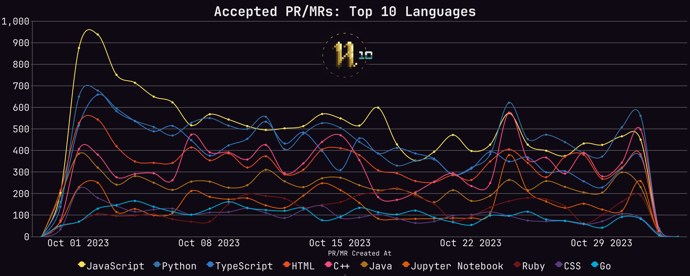
     
    <i>Pull requests each day for the top 10 languages during Hacktoberfest 2020</i>

**Before we go any further, we should note that this stats report excludes any users that no longer existed on GitHub
 after Hacktoberfest, as well as excluding any PRs that were no longer publicly available, which may result in slightly
 different total numbers reported compared to other posts.**

## Diving in: Pull Requests

Taking a closer look at the pull requests of Hacktoberfest 2020, we can pull out some more interesting insights.

First of all, we need to take a look at the breakdown of pull requests that Hacktoberfest tracked this year, and how
 many were considered eligible for the competition. In case you missed it, Hacktoberfest became opt-in this year after
 the first few days, requiring a PR be submitted in a repository with the `hacktoberfest` topic and the PR then being
 merged or approved by a maintainer to count, or the PR could be given the `hacktoberfest-accepted` label in any repo to
 count. PRs submitted before the rules change did not need to be accepted, the same as last year.

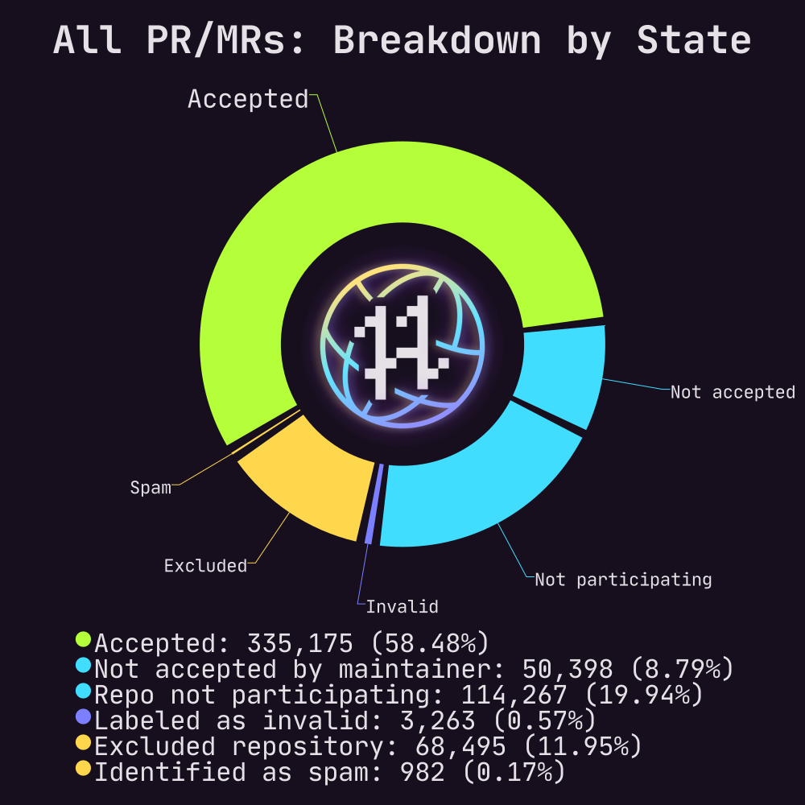

In total, Hacktoberfest tracked **632,223** pull requests, with **387,052 (61.22%)** of those being eligible and
 counting toward a user winning Hacktoberfest! We can breakdown exactly how those PRs were accepted and considered
 eligible in just a second. Beyond the eligible PRs, there were also **207,194 (32.77%)** PRs that weren't accepted,
 with **172,599 (83.30%)** of those being submitted to repositories not participating in Hacktoberfest 2020 and
 **34,595 (16.70%)** not accepted by a maintainer in an otherwise participating repo.

There were also **26,858 (4.25%)** PRs that were considered actively invalid by the Hacktoberfest app. This consists of
 two types of PRs, those that have been actively identified by a maintainer as spam, and those that were submitted to a
 repository we felt didn't follow the values of Hacktoberfest, and so were excluded from the competition. There were
 **17,260 (64.26%)** PRs submitted to excluded repositories, and **9,598 (35.74%)** PRs labelled as invalid or spam by
 maintainers (if a PR was merged in a participating repo but also labelled as spam/invalid, the label was ignored and
 the PR would be considered eligible).

Thank you to all those in the community who helped us by reporting repositories that didn't follow the values of
 Hacktoberfest through the Hacktoberfest website and to the maintainers who opted-in to Hacktoberfest and spent their
 time reviewing pull requests, accepting legitimate contributions and identifying spammy or invalid PRs via labels.

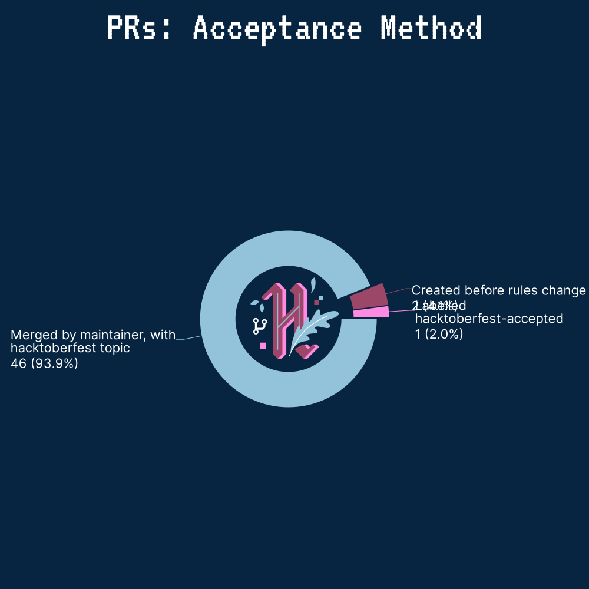

Now, let's take a closer look at those **387,052 (61.22%)** PRs that were eligible for Hacktoberfest, and by what
 criteria they became eligible. Prior to the opt-in rules coming into effect on October 3rd, **114,944 (29.70%)** PRs
 were created on public repositories and counted toward Hacktoberfest.

Within the repositories that opted-in to Hacktoberfest 2020 with the `hacktoberfest` topic, there were a few ways for a
 PR to be considered eligible. **166,057 (42.90%)** PRs were merged by a maintainer, within an opted-in repository,
 counting toward Hacktoberfest. Just **1,043 (0.27%)** PRs were considered eligible for Hacktoberfest by having an
 overall approving review by maintainers within a participating repository, and **67,533 (17.45%)** PRs were accepted
 with the `hacktoberfest-accepted` label in a repo with the `hacktoberfest` topic.

Outside of the participating repositories, any PR on a public GitHub repo could also be given the
 `hacktoberfest-accepted` label to count toward the competition, with **34,698 (8.96%)** PRs being considered eligible
 through this method. There were also **2,777 (0.72%)** PRs in the dataset for which we could not derive an acceptance
 method from the scraped GitHub data, but that had been accepted by the Hacktoberfest app during the competition.

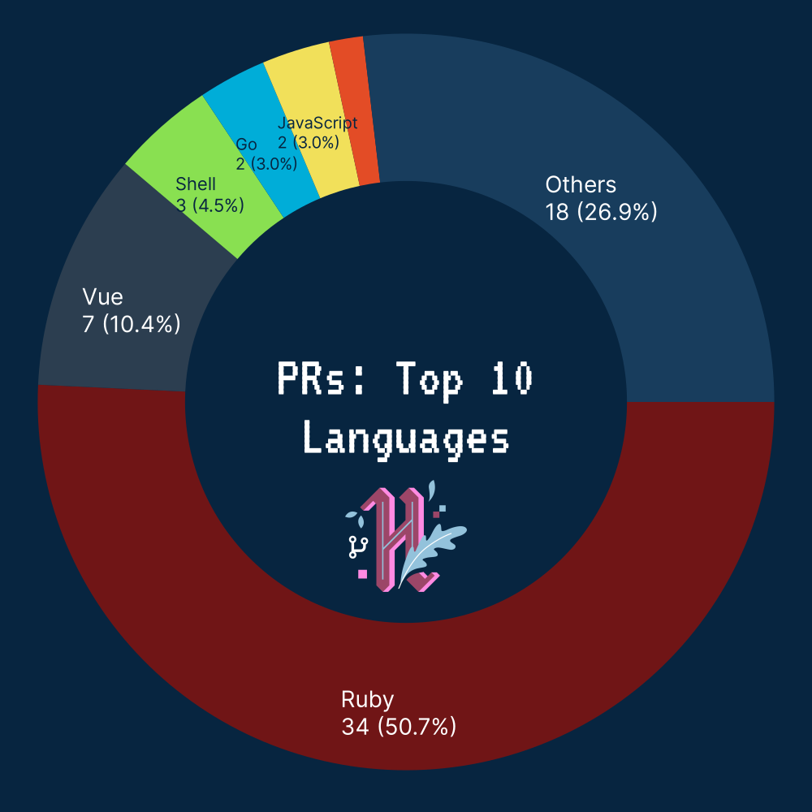

From the data we've collected not only for PRs but also for repositories, we can tie each PR to a programming language,
 based on the primary language that GitHub attributes to each repository.

Here's a breakdown of the top 15 languages in Hacktoberfest PRs (there were **225 programming languages** in total):

- Python: 60,285 (15.58%)
- JavaScript: 54,363 (14.05%)
- HTML: 40,697 (10.51%)
- C++: 40,444 (10.45%)
- Undetermined: 37,293 (9.64%)
- Java: 29,468 (7.61%)
- TypeScript: 15,891 (4.11%)
- Jupyter Notebook: 14,972 (3.87%)
- C: 13,616 (3.52%)
- PHP: 11,653 (3.01%)
- CSS: 10,337 (2.67%)
- Go: 8,542 (2.21%)
- C#: 6,729 (1.74%)
- Ruby: 5,253 (1.36%)
- Dart: 4,815 (1.24%)

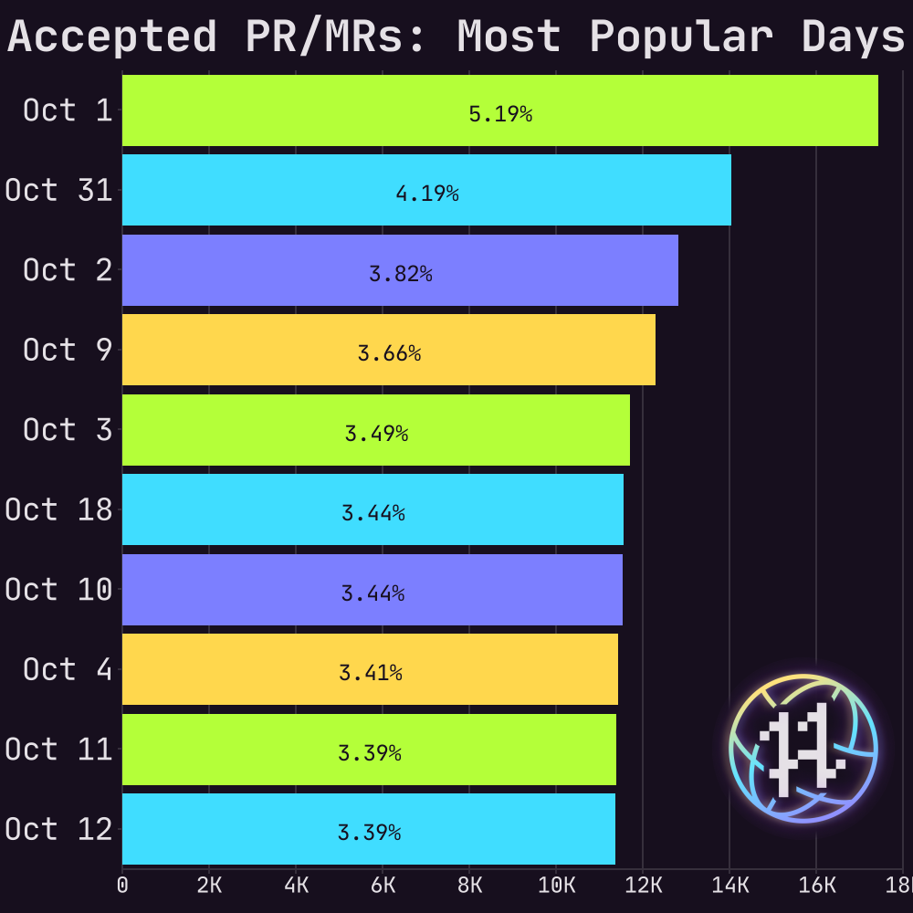

We can also take a look at when the most pull requests were submitted by day during Hacktoberfest. There was a massive
 initial splash on the first of October this year, when Hacktoberfest saw **20% of all eligible PRs submitted in
 just a single day**. This is likely in-part due to the spam issue that many users may be aware happened at the start of
 Hacktoberfest this year, and led to the opt-in change that we made.

Here's a breakdown of the busiest 10 days during the competition based on when eligible PRs, those that counted toward
 winning Hacktoberfest, were created:

- October 1 | 77,993 (20.15%)
- October 2 | 43,138 (11.15%)
- September 30 | 27,327 (7.06%)
- October 3 | 20,474 (5.29%)
- October 4 | 12,801 (3.31%)
- October 5 | 12,360 (3.19%)
- October 6 | 12,019 (3.11%)
- October 17 | 9,933 (2.57%)
- October 7 | 9,821 (2.54%)
- October 31 | 9,527 (2.46%)

You may also note that *September 30* is included in this list -- to allow Hacktoberfest to run from October 1st to 31st
 in all timezones, Hacktoberfest actually starts tracking PRs from Sept. 30 at 10:00am UTC all the way through to Nov. 1
 at 12:00pm UTC.

## Diving in: Repositories

Using the pull requests that we track during GitHub, we can also determine the set of repositories there were involved
 in Hacktoberfest and fetch data on those from GitHub.

As mentioned before, Hacktoberfest switched to being an opt-in event, where repositories had to add the `hacktoberfest`
 topic to have PRs count toward winning Hacktoberfest (PRs could also be opted-in individually with the
 `hacktoberfest-accepted` label). During Hacktoberfest 2020, we tracked a total of **176,053 repos** involved in
 Hacktoberfest, with **116,361 (66.09%)** considered to be participating as they received one or more eligible PRs
 during the competition. Alongside that, **42,413 (24.09%) repos** out of all those that we tracked made use of the
 `hacktoberfest` topic to actively opt-in to the Hacktoberfest competition.  

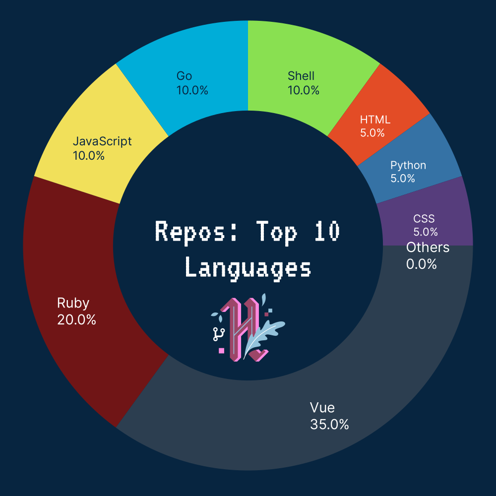

Here's a breakdown of the top 15 languages across all the repositories:

- JavaScript: 26,658 (15.14%)
- Python: 26,150 (14.85%)
- Undetermined: 23,481 (13.34%)
- HTML: 19,050 (10.82%)
- Java: 12,085 (6.86%)
- C++: 9,889 (5.62%)
- TypeScript: 7,100 (4.03%)
- PHP: 6,117 (3.47%)
- CSS: 5,412 (3.07%)
- C: 5,095 (2.89%)
- Jupyter Notebook: 4,521 (2.57%)
- Go: 4,169 (2.37%)
- C#: 3,292 (1.87%)
- Ruby: 2,983 (1.69%)
- Shell: 2,851 (1.62%)

Unfortunately, in many cases, GitHub cannot identify the main language for a repository and so this is shown as
 "Undetermined" in the data we're presenting here. In total, we saw **249 programming languages** across all the
 repositories that we could fetch data for as part of Hacktoberfest this year.

Much like with the Hacktoberfest PRs, we can directly take a look at how we dealt with spam in the form of repos.
This year, we used the same system as in 2019 to allow the community to report repositories that they felt didn't follow
 our values, and we then reviewed and excluded those that we agreed didn't follow the shared values for the competition.

This system worked well once again, as it allowed us to identify and exclude **124 (0.07%) repos** that the community
 felt didn't follow our shared values, of the **176,053 total repos** that were involved with Hacktoberfest.

We can also pull out some interesting data on assorted averages for a participating repositories in Hacktoberfest, such
 as that the average number of stars a repository had was **244.55 stars**, with **65.92 forks** and **13.24 watchers**
 on average. We can also look at the average contributions to a repository, where we saw that a participating repository
 received **3.33 eligible PRs** on average, alongside **0.29 unaccepted PRs** and **0.06 identified invalid/spam PRs**.

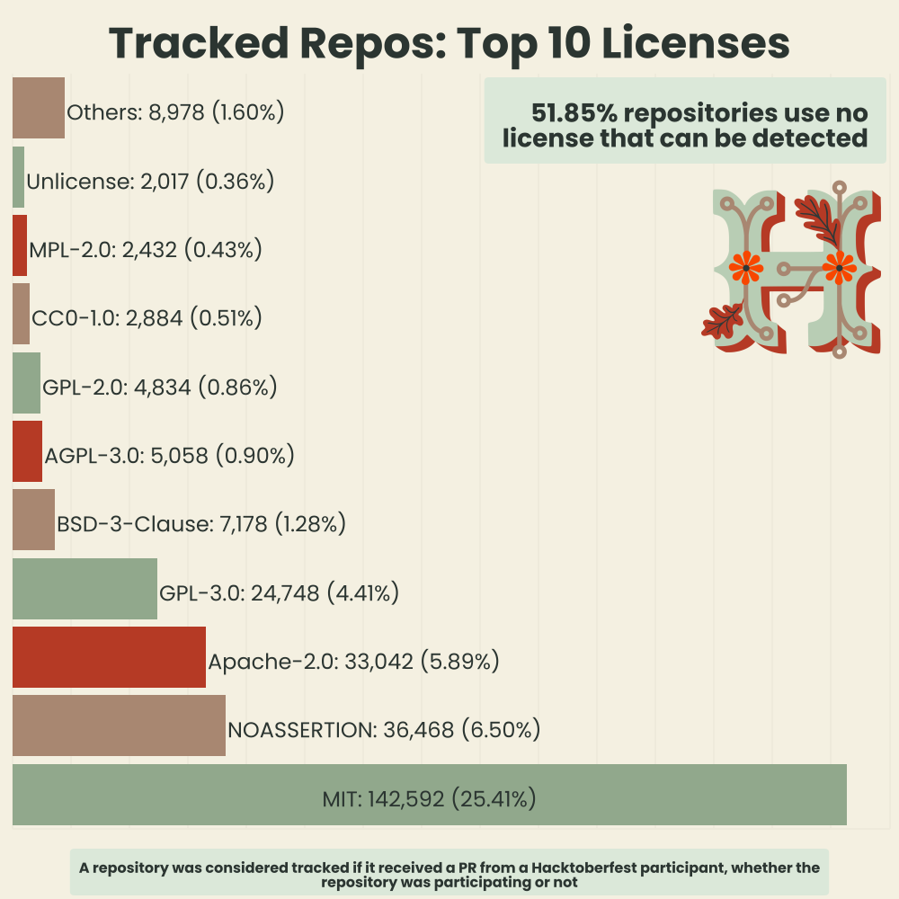

Another interesting bit of analysis that we can do is to take a look at the different licenses that GitHub detects for
 each repository. Whilst doing this, it became very apparent that many repositories either don't use a license or a
 license in a format that GitHub cannot detect, as the data indicates that **over 50% of repositories had no detectable
 license**.

We can also do a breakdown of these to see what licenses are the most popular in the open-source space:

- No License | 103,184  (58.61%)
- MIT | 37,626  (21.37%)
- Apache-2.0 | 10,228  (5.81%)
- Custom License | 8,753  (4.97%)
- GPL-3.0 | 6,997  (3.97%)
- BSD-3-Clause | 2,012  (1.14%)
- AGPL-3.0 | 1,393  (0.79%)
- GPL-2.0 | 1,294  (0.74%)
- MPL-2.0 | 855  (0.49%)
- CC0-1.0 | 722  (0.41%)
- Unlicense | 574  (0.33%)
- LGPL-3.0 | 428  (0.24%)
- BSD-2-Clause | 426  (0.24%)
- ISC | 302  (0.17%)
- LGPL-2.1 | 220  (0.12%)

## Diving in: Users

With the user data we have as part of Hacktoberfest, we can take a look at the number of pull requests users submitted
 on average as well as the countries that the users of Hacktoberfest represent. In total **192,804 users** authenticated
 with the Hacktoberfest, with **167,991 (87.13%)** completing registration. 

Of those users, there were **84,238 (43.69%) users** who participated in Hacktoberfest by submitting one or more
 eligible PRs (80,334), with **65,859 (34.16%)** who won Hacktoberfest.

This number is based on the number of users in the stats report that were in a winning state within the application.
 This is lower than the number reported at the top of this stats report as the main body of this report does not include
 users who no longer exist on GitHub. We also have **864,839 (33.63%)** users in the report that met the 4+ eligible PRs
 criteria, which is also even lower as the stats report only considers PRs that are still publicly available, not any in
 repos that have been deleted or made private.

Similarly, the number of total registrations differs in this section when compared to the number at the top, as again,
 this report only considers users that can still be found on GitHub whereas the number at the top of this report is raw
 from the Hacktoberfest database. From this, we can make a guess that approximately **1,895 users** were deleted from or
 suspended on GitHub during Hacktoberfest.

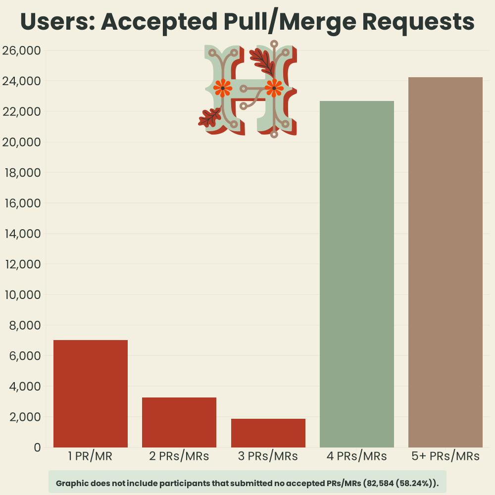

From the data, we can see that a user in Hacktoberfest submitted an average of **3.28 PRs**, with **2.01 PRs** being
 considered eligible, **1.07 PRs** not being accepted and **0.14 PRs** being identified as spam on average. 

Taking a look at the breakdown for the number of eligible PRs each user in Hacktoberfest submitted, it's awesome to see
 so many users who go above and beyond, submitting more than the 4 needed to win swag this year:

- 1 PR: 10,614 (5.51%)
- 2 PRs: 5,157 (2.67%)
- 3 PRs: 3,628 (1.88%)
- **4 PRs: 34,741 (18.02%)**
- 5 PRs: 12,736 (6.61%)
- 6 PRs: 6,086 (3.16%)
- 7 PRs: 3,341 (1.73%)
- 8 PRs: 2,344 (1.22%)
- 9 PRs: 1,429 (0.74%)
- 10 PRs: 1,010 (0.52%)
- 10+ PRs: 3,152 (1.63%)

This year Hacktoberfest users also had the option to specify which country they were from when they signed up to
participate, which gives us some awesome insight into the global reach of Hacktoberfest and the open-source community!

| - | - |
|---|---|
| 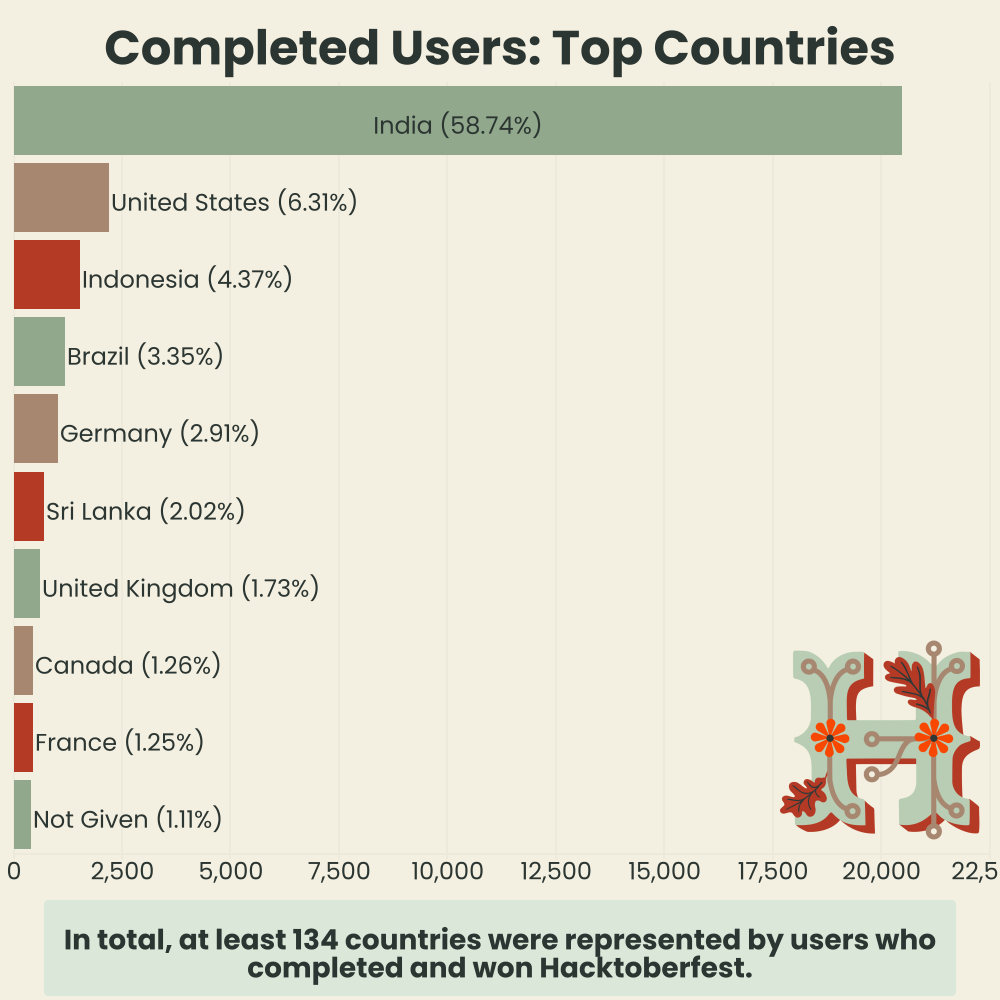 | 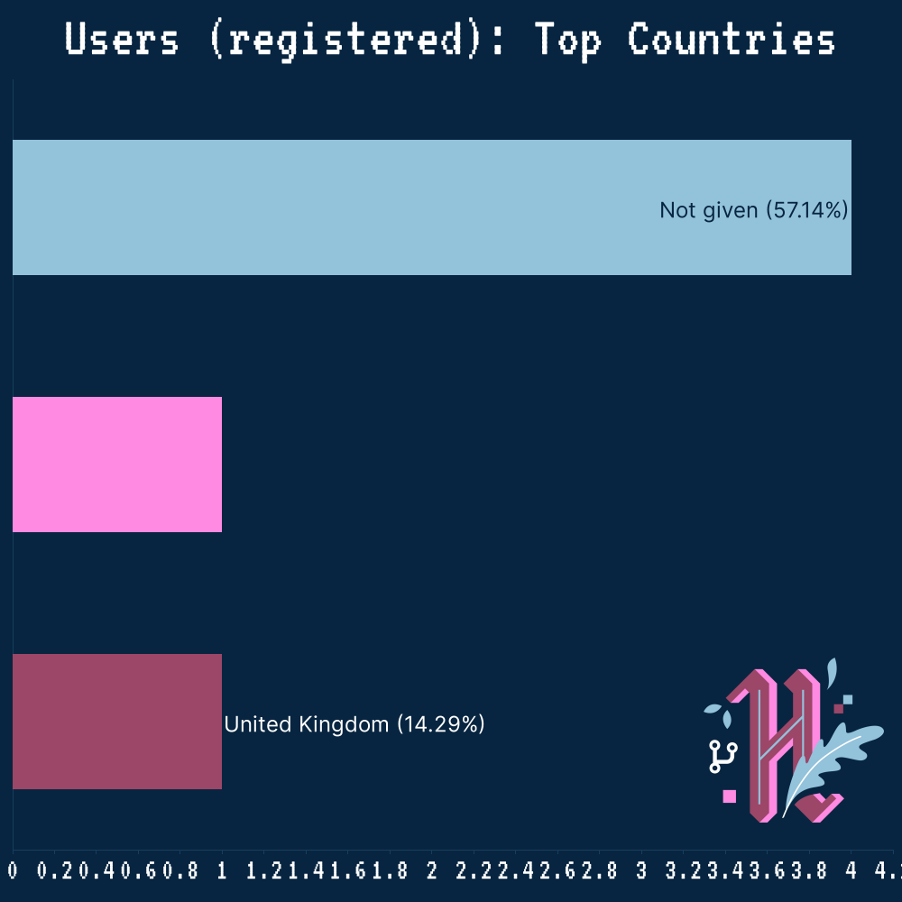 |

Although this field was completely optional, we can see from the data that at least **203 countries** were represented
 by users who registered to participate in Hacktoberfest 2020, and at least **161 countries** were represented by users
 who completed and won the competition. Out of all the users who registered, only **13,135 (7.82%)** opted to not
 provide their country during the registration process.

Looking at the breakdown of registrations by country, we can see the massive reach that open-source has in India, with
 over **40%** of registrations being from India, as well as in the US where over **10%** of participants were located:

- [IN] India | 71,884 (42.79%)
- [US] United States | 17,516 (10.43%)
- [--] Not given | 13,135 (7.82%)
- [BR] Brazil | 8,756 (5.21%)
- [ID] Indonesia | 5,330 (3.17%)
- [DE] Germany | 4,843 (2.88%)
- [GB] United Kingdom | 4,248 (2.53%)
- [CA] Canada | 2,894 (1.72%)
- [FR] France | 2,311 (1.38%)
- [RU] Russian Federation | 2,082 (1.24%)
- [ES] Spain | 1,730 (1.03%)
- [LK] Sri Lanka | 1,665 (0.99%)
- [AU] Australia | 1,487 (0.89%)
- [NL] Netherlands | 1,430 (0.85%)
- [PL] Poland | 1,428 (0.85%)

Well, that's all the stats I've generated from the Hacktoberfest 2020 raw data -- you can find the raw output of the
 stats generation script in the [`generated/stats.txt`](generated/stats.txt) file, as well as all the graphics which are
 housed in [`generated`](generated) directory.

If there is anything more you'd like to see/know, please feel free to reach out and ask, I'll be more than happy to
 generate it if possible.

All the scripts used to generate these stats & graphics are contained in this repository, in the [`src`](src) directory.
I have some more information about this in the [CONTRIBUTING.md](CONTRIBUTING.md) file, however, the Hacktoberfest 2020
 raw data, like the 2019 data, isn't public currently due to it containing PII about Hacktoberfest participants.

    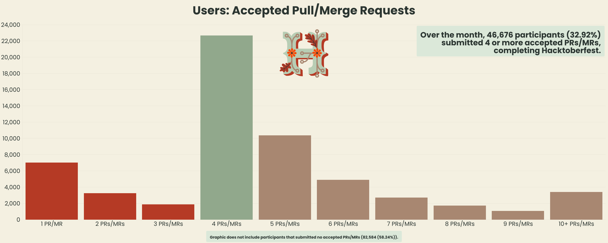
     
    <i>Number of pull requests submitted by each participant during Hacktoberfest 2020</i>

Author: [Matt Cowley](https://mattcowley.co.uk/) - If you notice any errors within this document, please let me know and
 I will endeavour to correct them. 💙
